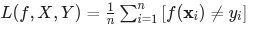

_Machine Learning Introduccion_

Clasificación Sueprvisada

Los problemas a solucionar con Machine learning (supervised) son de dos tipos:

1) **Problemas de clasificación**: buscan predecir el valor de una variable objetivo categorica, a partir de un conjunto de variables predictoras.

En clasificación la categoriía a predecir se conoce como 'etiqueta' (class label), y s ebasa en una serie de varibales observadas conocidas. En el caso de que la 'etiqueta' solo pueda tomar dos valores, se habla de _clasificación binaria_; en el caso de que pueda tomar más valores se habla de _clasificación multiclase_.

2) **Problemas de regresión**: buscan obtener un valor numérico.

En ambos casos, el objetivo es "aprender" automaticamente las reglas de relacion entre la interacción de los elementos conocidos (variables predictoras) y la variable a predecir (etiqueta).

Para hacerlo posible en aprendizaje supervisado, los datos de entrada tienen tanto las mediciones del objeto como las etiquetas; el modelo entonces aprende las relaciones entre las mediciones y la etiqueta.

Una vez que le modelo "aprende" las relaciones, se puede emplear para predecir etiquetas descococidas a aprtir de nuevas mediciones. 

_La calidad del dato_ puede depender de:

- Dificultad del problema
- calidad de dataset
- calidad del algoritmo

**Definición - Algoritmo de aprendizaje automático supervisado** | Un algoritmo de aprendizaje supervisado es un algoritmo que aprende reglas y cómo interactúan entre sí a partir del conjunto de datos etiquetados para realizar tareas de regresión o clasificación.

**Pipeline de ML**

Extract-Prepare-Build-Deploy

1) Extracción de los datos
2) Preparación de los datos
3) Contrucción del modelo
4) Implementación del modelo

**¿Cómo se define la complejidad de un modelo de IA?**

El nivel de información que el modelo procesa para hacer las predicciones. En este sentido, se pueden ordenar en 4 categorias:

IA Básica: Es una Ia que no aprende de los "experiencias" previas para influeciar respuestas presentes o futuras.  _"No aprende, solo responde a las condiciones existentes"_

IA Limitada: requiere una cantidad substancial de datos. Su ventaja es que aprende a resolver problemas sin ser "explicitamente" programada para ello. _"Aprende de experiencias previas"_

IA Avanzada: Es capaz de aprender y razonar a un nivel similar al de los humanos. _"Aprende y razona como un humano"_

Superinteligencia Artificial: Es una IA que supera la inteligencia humana en todos los aspectos. _"Supera la inteligencia humana"_

**La visualizacion en el ML**

La visualización nos ayuda a entender las predicciones de un modelo de machine learning. Es muy útil en problemas sencillos con solo dos o tres características, donde podemos ver las regiones de decisión y las fronteras de decisión. Sin embargo, se vuelve casi imposible en problemas con muchas características (cientos o miles), por lo que su utilidad es limitada a esos 
casos simples.

**Evaluación de la Clasificación**

***Sobreajuste (Overfitting)***: Ocurre cuando un modelo de machine learning se ajusta demasiado a los datos de entrenamiento, capturando no solo las tendencias generales sino también el ruido y las fluctuaciones aleatorias. Esto puede llevar a un rendimiento deficiente en datos nuevos o no vistos, ya que el modelo no generaliza bien. _"Un modelo sobreajustado puede tener una alta precisión en los datos de entrenamiento pero una baja precisión en los datos de prueba o en situaciones del mundo real"_

***Función de pérdida (Loss Function)***: se utiliza para resumir en un solo número qué tan bien nuestras predicciones coinciden con las etiquetas reales. Calculemos la tasa de error de clasificación (en inglés, misclassification rate) contando el número total de errores de clasificación y dividiéndolo por el número total de puntos de datos:

